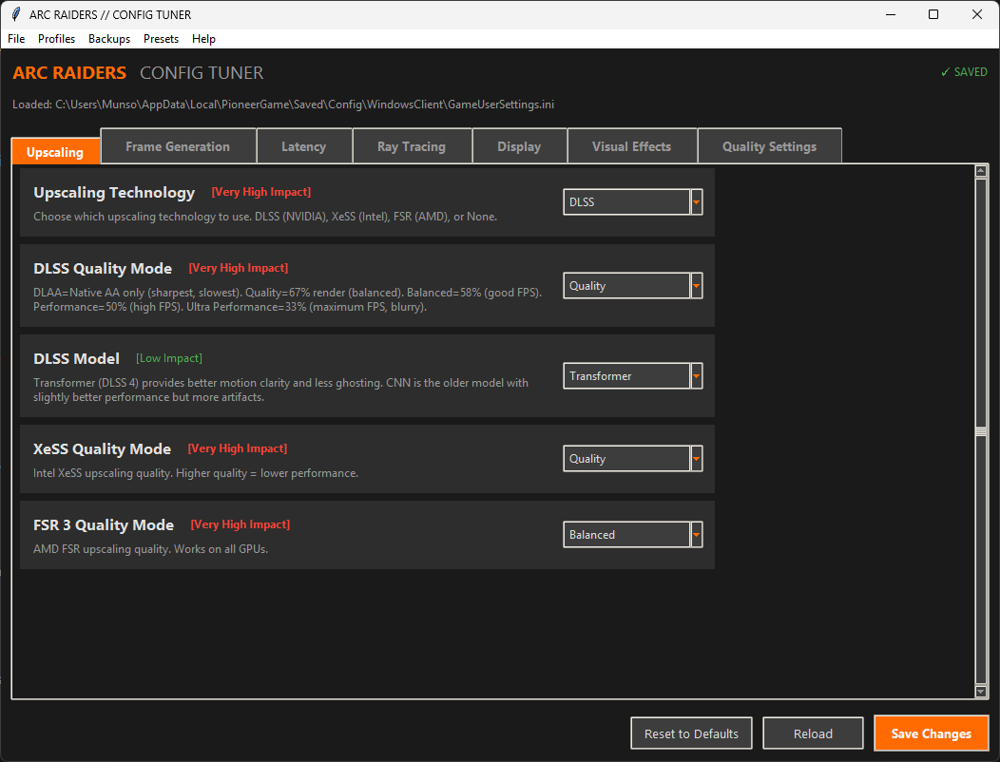
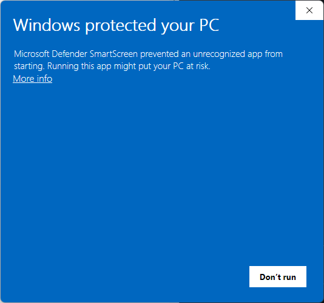
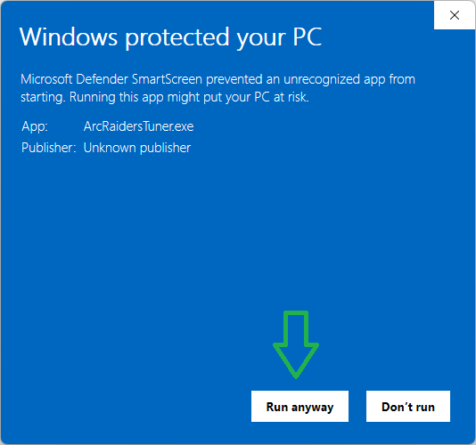

# Arc Raiders Config Tuner

A secure, user-friendly configuration manager for Arc Raiders. Easily tune your graphics settings, manage multiple profiles, and never lose your configs with automatic backups.


## Platform Support

- **Windows** - Native support with standalone .exe
- **SteamOS / Steam Deck** - Works via Proton (Arc Raiders is Steam Deck Verified as of November 2025)
- **Linux** - Compatible with Steam/Proton installations

## Features

- **Easy-to-Use Interface** - All settings explained with performance impact indicators
- **Automatic Backups** - Never lose your settings, backups created before every save
- **Multiple Profiles** - Save and load different configurations for competitive, quality, etc.
- **Built-in Presets** - One-click presets for common use cases
- **Secure** - No network access, validates all file paths, no code execution
- **Zero Dependencies** - Single .exe on Windows, Python stdlib only on Linux

## Screenshot



*Dark theme with Arc Raiders branding • Tabbed interface • Performance impact indicators • One-click presets*

## Installation

### Windows

#### Option 1: Download Pre-built Executable (Recommended)
1. Download `ArcRaidersTuner.exe` from the [Releases page](https://github.com/aj-geddes/arc-raiders-tuner/releases)
2. Run it - no installation required!

#### Windows SmartScreen Warning

When you first run the app, Windows will show a SmartScreen warning. **This is normal** for open-source software that isn't signed with an expensive code signing certificate.

| Step 1: Click "More info" | Step 2: Click "Run anyway" |
|:-------------------------:|:--------------------------:|
|  |  |

The app is completely safe — the full source code is available in this repository for review.

#### Option 2: Run from Source (Windows)
```bash
# Clone or download this repository
git clone https://github.com/aj-geddes/arc-raiders-tuner.git
cd arc-raiders-tuner

# Run directly (requires Python 3.8+)
python arc_tuner.py
```

#### Option 3: Build Your Own Executable (Windows)
```bash
# Install PyInstaller
pip install pyinstaller

# Build (Windows)
build.bat

# Or manually:
pyinstaller --onefile --windowed --name "ArcRaidersTuner" arc_tuner.py
```

### SteamOS / Steam Deck

1. **Switch to Desktop Mode** - Press the Steam button, select "Power", then "Switch to Desktop"
2. **Install Python tkinter** (if not already installed):
   ```bash
   # SteamOS 3.x (Arch-based)
   sudo pacman -S tk

   # Or use the Discover app store to install "Python tkinter"
   ```
3. **Download the repository**:
   ```bash
   git clone https://github.com/aj-geddes/arc-raiders-tuner.git
   cd arc-raiders-tuner
   ```
4. **Run the application**:
   ```bash
   python3 arc_tuner.py
   ```

The app will automatically detect your Steam Deck and find the Arc Raiders config at:
```
~/.local/share/Steam/steamapps/compatdata/1808500/pfx/drive_c/users/steamuser/AppData/Local/PioneerGame/Saved/Config/WindowsClient/GameUserSettings.ini
```

**Note**: Arc Raiders must be run at least once to create the config file. Arc Raiders App ID is `1808500`.

### Linux (General)

Requirements:
- Python 3.8+
- tkinter (`python3-tk` on Debian/Ubuntu, `tk` on Arch)
- Steam with Proton
- Arc Raiders installed and run at least once

The app supports both standard Steam and Flatpak Steam installations and will automatically detect the correct config file location.

```bash
# Install tkinter if needed
# Debian/Ubuntu:
sudo apt install python3-tk

# Arch/SteamOS:
sudo pacman -S tk

# Fedora:
sudo dnf install python3-tkinter

# Run the app
git clone https://github.com/aj-geddes/arc-raiders-tuner.git
cd arc-raiders-tuner
python3 arc_tuner.py
```

## Usage

### First Launch

#### Windows
1. Run `ArcRaidersTuner.exe`
2. The app automatically finds your Arc Raiders config at:
   ```
   %LOCALAPPDATA%\PioneerGame\Saved\Config\WindowsClient\GameUserSettings.ini
   ```
3. If not found, use **File → Open Config** to locate it manually

#### SteamOS / Linux
1. Run `python3 arc_tuner.py`
2. The app automatically detects your platform and finds the config at:
   ```
   ~/.local/share/Steam/steamapps/compatdata/1808500/pfx/drive_c/users/steamuser/AppData/Local/PioneerGame/Saved/Config/WindowsClient/GameUserSettings.ini
   ```
   (Also supports Flatpak Steam locations)
3. If not found, use **File → Open Config** to locate it manually

### Changing Settings
1. Navigate tabs (Upscaling, Latency, Ray Tracing, etc.)
2. Adjust settings using dropdowns, checkboxes, and sliders
3. Each setting shows its **performance impact** (Low/Medium/High/Very High)
4. Click **Save Changes** when done
5. A backup is automatically created before saving

### Using Presets
Quick-apply optimized configurations:
- **Competitive** - Maximum FPS, lowest latency
- **Balanced** - Good visuals with solid performance  
- **Quality** - Maximum visual fidelity
- **Cinematic** - Best visuals with frame generation

### Managing Profiles
Save your custom configurations:
1. **Profiles → Save Profile** - Save current settings with a name
2. **Profiles → Load Profile** - Load a saved configuration
3. **Profiles → Manage Profiles** - Delete unwanted profiles

### Backups
Never lose your settings:
- Automatic backup created before every save
- **Backups → Create Backup** - Manual backup anytime
- **Backups → Restore Backup** - Restore any previous config
- **Backups → Open Backup Folder** - Access backup files directly

## Settings Reference

### Upscaling Technologies

| Technology | Vendor | Best For |
|------------|--------|----------|
| **DLSS** | NVIDIA | RTX GPUs - Best quality with Tensor cores |
| **XeSS** | Intel | All GPUs - Best on Intel Arc |
| **FSR 3** | AMD | All GPUs - No special hardware needed |

### DLSS Modes

| Mode | Render Scale | FPS Gain | Quality |
|------|-------------|----------|---------|
| DLAA | 100% | 0% | Sharpest (AA only) |
| Quality | 67% | 30-50% | Excellent |
| Balanced | 58% | 45-65% | Good |
| Performance | 50% | 60-100% | Acceptable |
| Ultra Performance | 33% | 100%+ | Blurry |

### Latency Reduction

| Setting | Effect |
|---------|--------|
| **Reflex On** | 20-50% latency reduction |
| **Reflex On+Boost** | Better for CPU-bound scenarios |
| **Frame Generation** | ⚠️ Adds 15-30ms latency! |

### RTX Global Illumination

| Setting | Performance Cost | Use Case |
|---------|-----------------|----------|
| Static | 0% | Competitive - Best FPS |
| DynamicHigh | 25-35% | Balanced |
| DynamicEpic | 35-45% | Quality - Best visuals |

### Competitive Settings

> ⚠️ **WARNING**: Some settings in this section are experimental and may cause instability or visual artifacts. Settings marked with ⚠️ should be tested carefully before use in ranked matches.

#### Mouse & Input
| Setting | Recommended | Description |
|---------|-------------|-------------|
| Mouse Smoothing | OFF | Adds input lag and inconsistent aim |
| Mouse Acceleration | OFF | Causes inconsistent muscle memory |

#### Visual Clutter
| Setting | Competitive Value | Effect |
|---------|------------------|--------|
| Depth of Field | 0 (Off) | Removes distance blur |
| Bloom | 0 (Off) | Reduces visual noise |
| Lens Flare | 0 (Off) | Prevents light obstruction |
| Chromatic Aberration | 0 (Off) | Cleaner screen edges |
| Vignette | 0 (Off) | Full peripheral visibility |
| Film Grain | 0 (Off) | Cleaner image |

#### Performance Tweaks (⚠️ Experimental)
| Setting | Value | Effect | Stability |
|---------|-------|--------|-----------|
| One Frame Thread Lag | 0 | -1 frame input lag | ⚠️ May stutter |
| Smooth Frame Rate | Off | Lower latency | ⚠️ May stutter |
| Precompile Shaders | On | Less in-game stutter | Stable |

#### VRAM & Textures
| Setting | Recommendation | Notes |
|---------|---------------|-------|
| Texture Pool Size | GPU VRAM-based | 6GB=4096, 8GB=6144, 12GB+=8192 |
| Anisotropic Filtering | 16x | Minimal performance impact |

#### Audio
| Setting | Competitive Value | Effect |
|---------|------------------|--------|
| Audio Quality | Epic (3) | Best positional audio |
| Audio Spatialization | On | Better enemy location |

## Security

This application is designed with security in mind:

- ✅ **No network access** - Works completely offline
- ✅ **No code execution** - Only reads/writes INI files
- ✅ **Path validation** - Prevents directory traversal attacks
- ✅ **No elevation required** - Runs as standard user
- ✅ **Open source** - Full source code available for review

## File Locations

### Windows

| Item | Location |
|------|----------|
| Game Config | `%LOCALAPPDATA%\PioneerGame\Saved\Config\WindowsClient\GameUserSettings.ini` |
| Backups | `%LOCALAPPDATA%\PioneerGame\Saved\Config\WindowsClient\ArcTuner_Backups\` |
| Profiles | `%LOCALAPPDATA%\PioneerGame\Saved\Config\WindowsClient\ArcTuner_Profiles\` |

### SteamOS / Linux

| Item | Location |
|------|----------|
| Game Config | `~/.local/share/Steam/steamapps/compatdata/1808500/pfx/drive_c/users/steamuser/AppData/Local/PioneerGame/Saved/Config/WindowsClient/GameUserSettings.ini` |
| Backups | `~/.local/share/Steam/steamapps/compatdata/1808500/pfx/drive_c/users/steamuser/AppData/Local/PioneerGame/Saved/Config/WindowsClient/ArcTuner_Backups/` |
| Profiles | `~/.local/share/Steam/steamapps/compatdata/1808500/pfx/drive_c/users/steamuser/AppData/Local/PioneerGame/Saved/Config/WindowsClient/ArcTuner_Profiles/` |

**Note**: Arc Raiders App ID is `1808500`. Flatpak Steam uses a different base path but is automatically detected.

## Troubleshooting

### "Config Not Found"
- Make sure Arc Raiders has been run at least once
- Use **File → Open Config** to manually locate the file

### Settings Not Applying
1. Close Arc Raiders completely before saving
2. Disable cloud saves for Arc Raiders in your game launcher
3. Check if the file is read-only

### Backup/Profile Errors
- Ensure you have write permissions to the config folder
- Run as Administrator if needed (not recommended normally)

## Building from Source

### Windows Executable

Requirements:
- Python 3.8 or higher
- Windows 10/11

```bash
# Install build dependencies
pip install pyinstaller

# Build standalone executable
pyinstaller --onefile --windowed --name "ArcRaidersTuner" arc_tuner.py

# The .exe will be in the dist/ folder
```

### Running from Source (All Platforms)

Requirements:
- Python 3.8 or higher
- tkinter (usually `python3-tk` on Linux)

```bash
# No build needed - just run directly
python3 arc_tuner.py
```

## Contributing

Contributions welcome! Please:
1. Fork the repository
2. Create a feature branch
3. Submit a pull request

## License

MIT License - See [LICENSE](LICENSE) file for details.

## Credits

- **High Velocity Solutions LLC** - Development
- **Arc Raiders** is a trademark of Embark Studios

## Disclaimer

This is an unofficial tool and is not affiliated with, endorsed by, or connected to Embark Studios or Arc Raiders. Use at your own risk. Always keep backups of your configuration files.
